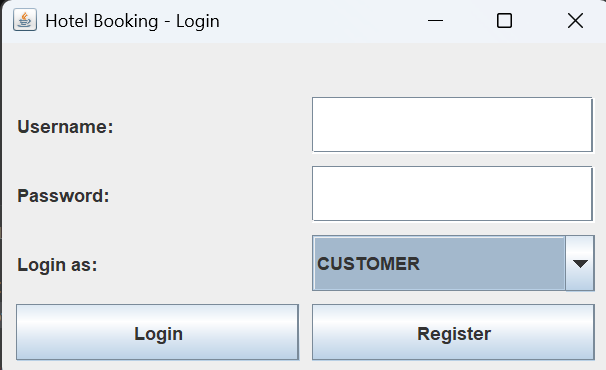
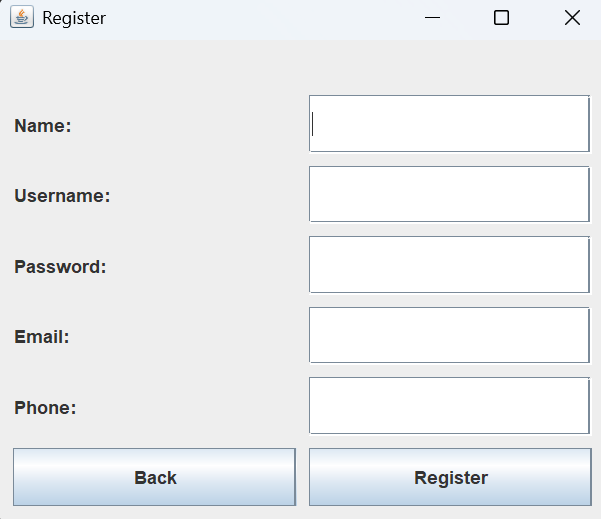
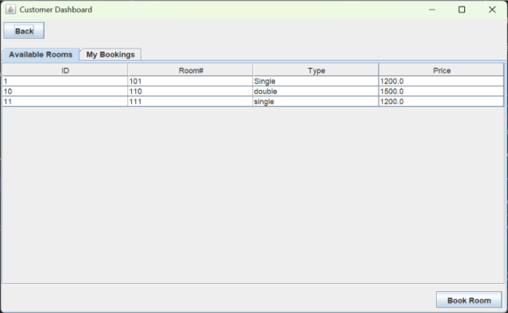
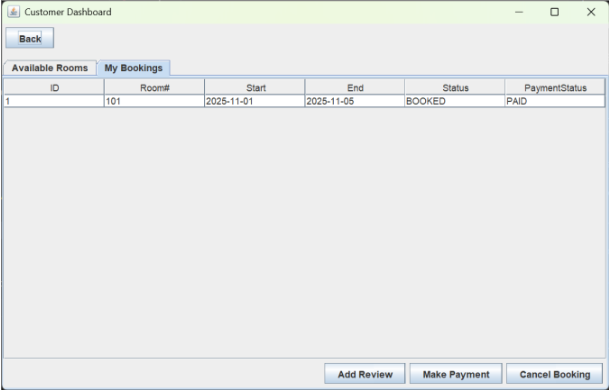
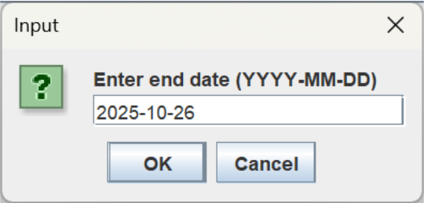
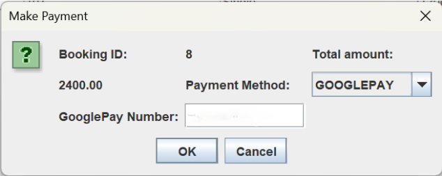
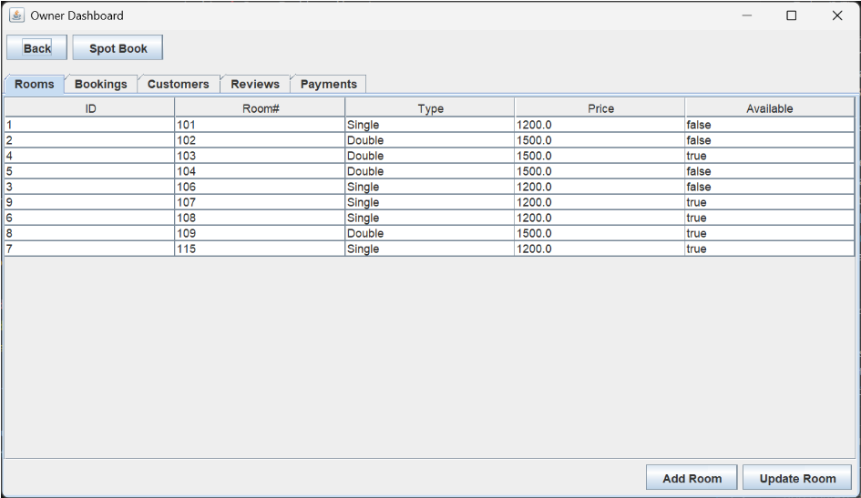
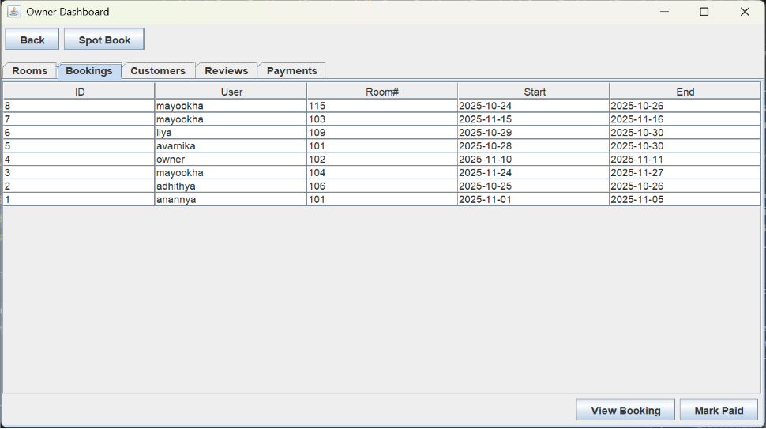
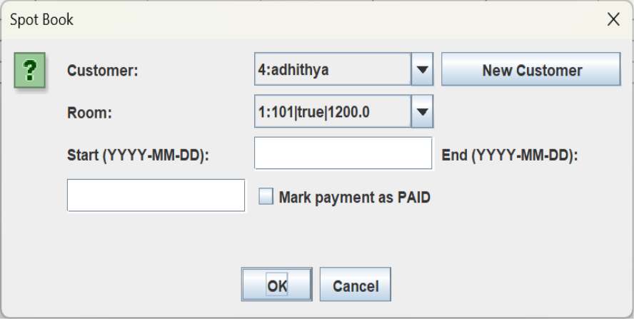
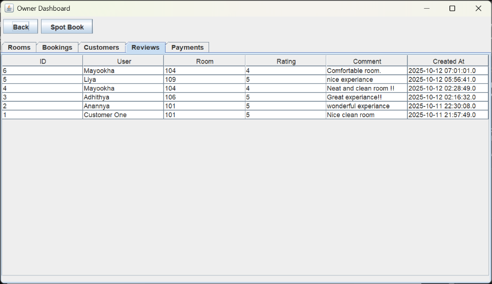

<div align="center">

# 🏨 Hotel Room Booking System

A desktop-based Hotel Room Booking System developed using **Java**, **Java Swing**, **JDBC**, and **MySQL**.

It automates hotel reservations by providing separate interfaces for customers and hotel owners to manage bookings, rooms, payments, and reviews.


</div>

---

# 📌 Project Overview

The Hotel Room Booking System is a desktop application designed to simplify hotel operations by replacing manual booking procedures with an automated and user-friendly solution.

The system provides dedicated modules for **Customers** and **Hotel Owners**, enabling efficient room booking, payment management, customer record maintenance, review management, and real-time room availability.

The project follows **Object-Oriented Programming (OOP)** principles and integrates **Java Swing** with **MySQL** using **JDBC**.

---

# ✨ Features

## 👤 Customer Module

- User Registration
- Secure Login
- View Available Rooms
- Book Rooms
- Online Payment
- Cancel Booking
- Booking History
- Ratings & Reviews

## 👨‍💼 Hotel Owner Module

- Owner Login
- Add Rooms
- Update Rooms
- Delete Rooms
- View Customer Details
- Booking Management
- Payment Management
- Spot Booking
- Review Management

---

# 🛠️ Technologies Used

| Technology | Purpose |
|------------|---------|
| Java | Core Programming |
| Java Swing | GUI Development |
| JDBC | Database Connectivity |
| MySQL | Database |
| Visual Studio Code | IDE |

---

# 🏗️ System Architecture

The application follows a **Three-Tier Architecture**.

```
Presentation Layer
        │
Java Swing GUI
        │
Business Logic
        │
      JDBC
        │
MySQL Database
```

---

# 📂 Project Modules

### Customer Module

- Registration
- Login
- Room Booking
- Payment
- Booking History
- Review Submission

### Hotel Owner Module

- Room Management
- Booking Management
- Customer Management
- Payment Tracking
- Spot Booking

### Database Module

- Customer Details
- Room Details
- Booking Records
- Payment Records
- Reviews

---

# 🚀 Installation

### Prerequisites

- Java JDK 8+
- MySQL Server
- MySQL Connector/J
- Visual Studio Code or any Java IDE

### Setup

Clone the repository

```bash
git clone https://github.com/Anannyaa97/Hotel-Room-Booking-System.git
```

Create a MySQL database.

Import the `schema.sql` file.

Update your JDBC username and password.

Run the project.

---

# 📸 Application Screenshots

## 🔐 Login & Registration

| Login | Register |
|-------|----------|
|  |  |

---

## 👤 Customer Dashboard

| Dashboard | Booking History |
|-----------|-----------------|
|  |  |

---

## 🛏️ Booking & Payment

| Room Booking | Payment |
|--------------|---------|
|  |  |

---

## 👨‍💼 Owner Dashboard



---

## 📋 View Bookings



---

## ⚡ Spot Booking



---

## ⭐ Customer Reviews



---

# 🎯 Key Highlights

- Secure Authentication
- Real-Time Room Availability
- Booking & Cancellation
- Payment Management
- Spot Booking
- Customer Review System
- Java Swing Desktop GUI
- MySQL Database Integration

---

# 📚 Learning Outcomes

Through this project I gained practical experience in:

- Object-Oriented Programming
- Java Swing GUI Development
- JDBC Connectivity
- MySQL Database Design
- CRUD Operations
- Event Handling
- Exception Handling
- Desktop Application Development

---

# 📄 License

This project was developed for educational purposes as part of the **Object-Oriented Programming** course.

---

<div align="center">

### ⭐ If you like this project, don't forget to give it a star!

</div>
